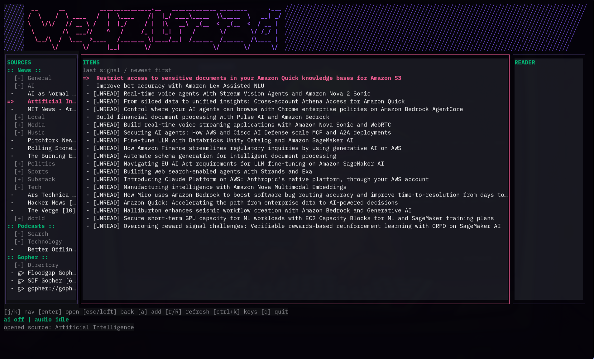

# WeazlFeed



Burn the algorithmic timeline and bypass the podcast-industrial complex.
WeazlFeed rips RSS, Atom, and straight-up 1993 Gopher payloads directly into
the terminal. It strips the HTML bloat, kills the tracking pixels, and renders
pure signal. Got a podcast? The MP3 gets piped instantly to `mpv` with a
reactive EQ. Point your local GPU at the text to filter out SEO sludge or
interrogate massive articles on the fly.

No browser tabs. No walled gardens. Just the raw feed on the bare metal.

## Features

- Local-first RSS and Atom reader backed by SQLite.
- Gopher reader for `gopher://` menus and text pages.
- Preloaded feed categories for tech, world news, sports, music, and Gopher.
- Podcast/audio enclosure playback through `mpv`.
- Playback resume with playhead checkpoints written during playback.
- `ffmpeg`-powered Harmonica EQ visualizer when audio is active.
- Podcast directory search inside the TUI, no paid API key required.
- Local LLM integration for article Q&A, tactical summaries, and sludge rules.
- Vault password unlock with encrypted feed/article payloads at rest.
- Three-pane BBS-style TUI with focused pane expansion.

## Install

```sh
git clone https://github.com/bprendie/weazlfeed.git
cd weazlfeed
./scripts/install.sh
```

The installer builds:

- `weazlfeed`
- `weazlfeed-setup`
- `weazlfeed-import`
- `weazlfeed-refresh`
- `weazlfeed-podcast-search`
- `weazlfeed-prune`
- `weazlfeed-vault`

They are installed to:

```text
~/.weazlfeed/bin
```

The installer also offers to add that directory to your shell `PATH`.

## Requirements

- Go 1.25 or newer
- SQLite support through `github.com/mattn/go-sqlite3`
- `mpv` for podcast/audio playback
- `ffmpeg` for the live EQ visualizer
- Optional: Ollama or a vLLM/OpenAI-compatible local endpoint for AI features

Text reading works without `mpv`, `ffmpeg`, or a local model.

## Run

```sh
weazlfeed
```

On first launch, WeazlFeed asks you to create a vault password. Later launches
require that password before the TUI opens. The password is checked with bcrypt,
the SQLite database file is forced to `0600` permissions, and feed/article
payloads are encrypted at rest after unlock.

Run setup again any time:

```sh
weazlfeed-setup
```

## Keybindings

| Key | Action |
| --- | --- |
| `j` / `k` | Move through the focused pane |
| `PgUp` / `PgDn` | Page the focused pane |
| `Home` / `End` | Jump within the focused pane |
| `tab` | Manually switch focus and expand that pane |
| `enter` | Open source, read item, dial Gopher target, or play audio |
| `esc` / `left` | Move back one pane, or stop/close active audio |
| `space` | Pick/drop sources in Sources; pause/resume audio elsewhere |
| `<` / `>` | Seek active audio back 10 seconds / forward 30 seconds |
| `p` | Open the podcast directory |
| `a` | Add a feed or Gopher URL to the selected folder |
| `n` | Create a folder in the selected section |
| `f` | Mark selected podcast episode finished |
| `ctrl+d` | Delete selected source after confirmation |
| `r` | Refresh selected source |
| `R` | Refresh all sources |
| `h` | Hide/show sludge-flagged items |
| `ctrl+k` | Open the keybinding help screen |
| `ctrl+a` | Ask the local model about the active item |
| `ctrl+t` | Generate a 3-point tactical summary |
| `q` / `ctrl+c` | Quit |

Mouse wheel scrolling works on the focused pane.
Press `ctrl+k` in the TUI for the full command deck.

## Feeds

On first run, WeazlFeed seeds a starter deck:

- `TECH`: Ars Technica, The Verge, Hacker News
- `WORLD`: BBC World, NPR News
- `SPORTS`: AP Sports
- `MUSIC`: Pitchfork News, Rolling Stone Music
- `GOPHER`: Floodgap Gopher, SDF Gopher

Feeds live in SQLite and are also seeded from config. The default config is
created at first launch. User moves stick: seed refreshes do not overwrite your
folder organization.

Inside Sources:

- `space` picks up the selected source; move to a folder; `space` drops it.
- `n` creates a folder under the selected section.
- `a` opens a centered URL prompt. `gopher://` URLs route to Gopher. Audio feeds
  route to Podcasts.
- `ctrl+d` opens a delete confirmation for the selected source.

Import OPML feed lists with:

```sh
weazlfeed-import feeds.opml
```

Search Apple Podcasts without a paid API key:

```sh
weazlfeed-podcast-search "darknet diaries"
weazlfeed-podcast-search -add 1 "darknet diaries"
```

Added podcast feeds land under `Podcasts/Search`.
Inside the TUI, press `p` to open the podcast directory. Search for a show,
select a result, and press `enter` or `a` to subscribe it into the selected
Podcasts folder. The new subscription refreshes immediately and jumps into view.

Refresh all feeds from the shell with a per-feed status report:

```sh
weazlfeed-refresh
```

Prune old cached items without deleting subscriptions:

```sh
weazlfeed-prune -days 30
```

By default pruning keeps unread items and podcast items with saved playback
positions. Use `-keep-unread=false` or `-keep-playhead=false` to prune more
aggressively.

Force a vault unlock/encryption migration without refreshing feeds:

```sh
weazlfeed-vault
```

OPML files are ignored by Git so private or personally curated feed lists stay
local.

## Gopher

Gopher URLs use normal `gopher://` form:

```text
gopher://sdf.org/
gopher://gopher.floodgap.com/
```

Directory menus become nested item lists. Text pages render in the Reader pane.
Selecting a Gopher item with `enter` dials the target and renders the next menu
or page. `esc` or `left` walks back through the Gopher menu stack.

## Local AI

Setup supports:

- `vllm`: queries `/v1/models`
- `ollama`: queries `/api/tags`

If the endpoint is offline, setup falls back to manual model entry.

AI features are tactical, not algorithmic:

- `ctrl+a`: ask a question about the active item
- `ctrl+t`: extract the three most important technical points
- Bouncer rules: mark SEO sludge during refresh when rules exist and the model
  is reachable

If the model is offline, the reader keeps working.

## Audio

Items with audio enclosures can be played with `enter`. Audio opens a centered
playback window with the current timestamp, total duration when known, and the
live EQ.

WeazlFeed starts `mpv` directly, without heavyweight bindings. During playback,
it periodically saves `playhead_seconds` to SQLite so long podcasts can resume
close to where they stopped, even after a bad exit.

If `ffmpeg` is available, the EQ is driven by a real decoded audio meter. No
fake bars. The Harmonica spring renderer just makes the real signal move like it
has weight.

Audio controls:

- `space`: pause/resume
- `<`: back 10 seconds
- `>`: forward 30 seconds
- `esc`: stop/close and save the playhead

Podcast episodes use podcast states instead of article states:

- `NEW`: untouched
- `LISTENING`: has a saved playhead
- `FINISHED`: marked complete

Press `f` on a podcast episode to mark it finished.

## Files

Default config:

```text
~/.config/weazlfeed/config.json
```

Default database:

```text
~/.local/share/weazlfeed/weazlfeed.sqlite3
```

Override paths:

```sh
WEAZLFEED_CONFIG=/path/to/config.json weazlfeed
WEAZLFEED_DATA=/path/to/data-dir weazlfeed
WEAZLFEED_HOME=/path/to/install-root ./scripts/install.sh
```

## Development

```sh
go test ./...
go build ./cmd/weazlfeed
go build ./cmd/weazlfeed-setup
go build ./cmd/weazlfeed-refresh
go build ./cmd/weazlfeed-podcast-search
go build ./cmd/weazlfeed-prune
go build ./cmd/weazlfeed-vault
```

The codebase is intentionally modular. Keep files below 400 LOC unless there is
a strong reason not to.

## Troubleshooting

- `mpv not found`: audio playback is disabled; text reading still works.
- `ffmpeg not found`: the EQ visualizer is disabled; audio playback can still
  work.
- Model endpoint connection refused: AI features are disabled until your local
  provider is running.
- Gopher connection fails: the target host may be offline, blocked, or not
  serving port 70.
- Forgotten vault password: there is no recovery flow; back up or replace the
  local database.
